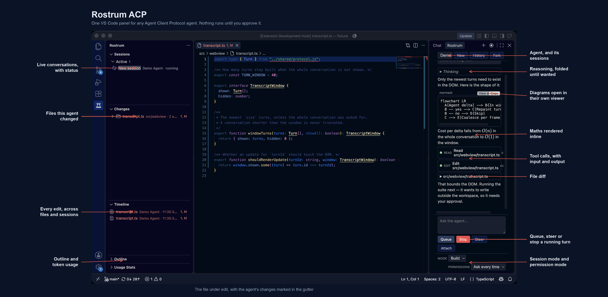
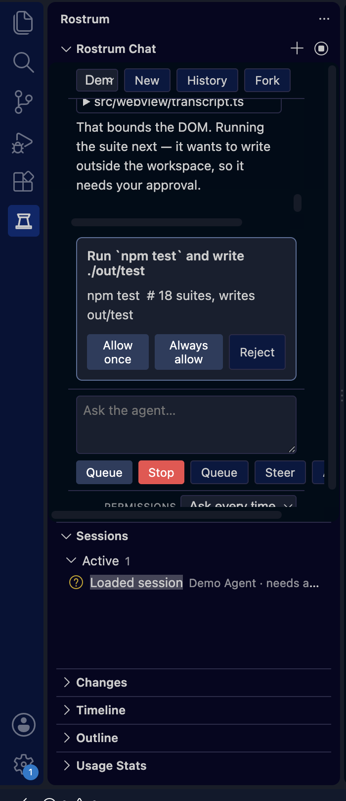

# Rostrum ACP

[](LICENSE)
[](https://code.visualstudio.com/)

**Conduct your [Agent Client Protocol (ACP)](https://agentclientprotocol.com/) coding agents from one VS Code workspace.**

Rostrum ACP is an free, open-source VS Code client for ACP. It runs compatible coding agents locally, gives you one place to steer their sessions, and keeps their work visible: streaming responses, reasoning, tool calls, permissions, plans, edits, diffs, session history, and usage information.

Rostrum is protocol-first rather than vendor-first: native ACP agents and adapter-backed CLIs appear through the same review surface, while each agent's advertised capabilities decide which controls are enabled. It communicates with agents through JSON-RPC over standard input/output using the official [`@agentclientprotocol/sdk`](https://www.npmjs.com/package/@agentclientprotocol/sdk).

<p align="center">
  
</p>

> [!IMPORTANT]
> Agents can read files and run commands in your workspace. Rostrum intentionally does not support untrusted workspaces. Review permission requests carefully and only configure agents you trust.

## How it works

1. **Choose an agent.** Rostrum detects several common CLIs on your `PATH`, can install agents from the [ACP registry](https://agentclientprotocol.com/get-started/registry), and accepts any hand-written ACP process definition.
2. **Rostrum launches it beside your code.** The agent remains a subprocess in your environment, using your account, credentials, model configuration, and workspace. In VS Code remote windows it runs on the remote workspace host.
3. **Work from a consistent interface.** ACP lets Rostrum translate the common parts—prompts, streaming output, permissions, sessions, and edits—into one VS Code experience, while capability negotiation preserves each agent’s unique features.

<p align="center">
  
</p>

## Why Rostrum

Rostrum is for developers who want the freedom to select the best coding agent for a task without giving up a coherent editor workflow. It is deliberately protocol-first: agent-specific features appear when supported, and unavailable operations are disabled rather than guessed at. That makes it practical to mix native ACP agents with adapter-backed agents in the same project.

| If you need… | Rostrum provides… |
| --- | --- |
| Agent choice | ACP-native and adapter-backed agents in one VS Code UI. |
| Visibility | Reasoning, tool calls, plans, edits, diffs, session outline, and history. |
| Control | Interactive permissions, configurable approval modes, and capability-gated actions. |
| Continuity | Persisted transcripts, recovery/load/resume paths, session export, and historical edit snapshots. |
| Locality | Processes run in the workspace environment, including SSH, WSL, and containers. |

## What you get

- A dedicated Rostrum Chat view alongside Sessions, Outline, Changes, Timeline, and Usage Stats in one stable Activity Bar container.
- Streaming agent messages, reasoning blocks, rich media/resources, tool calls and their status, plans/todos, and sub-agent delegation indicators.
- Interactive permission prompts with `ask`, `acceptEdits`, and `yolo` modes; structured agent questions and ACP elicitation are shown in the UI instead of being silently answered.
- Persistent transcripts: reopen the most recent workspace session, browse agent-provided and local history, load/resume conversations, fork when the agent supports it, delete saved sessions, and export transcripts as Markdown.
- Background sessions notify you when they need approval or finish while you are working elsewhere.
- Durable edit tracking, including changed files, a cross-file timeline, historical snapshots, and native VS Code diffs.
- Agent capabilities are negotiated at runtime. Rostrum only exposes optional actions—such as forking, slash commands, session settings, attachments, or MCP—that the connected agent advertises.
- Prompt queueing, mid-turn steering, text/image/audio attachments, slash-command completion, configurable session options, and token-usage reporting where supported by the agent.
- Editor context commands for attaching the active file, current selection, diagnostics, open editors, or workspace layout to the next prompt; `@` file mentions and pasted images are staged as attachments.
- Mermaid diagrams open in a separate viewer, and maths renders inline. Diagrams are deliberately kept out of the transcript: the renderer never turns agent output into markup, and Mermaid builds DOM from strings.
- A capability report showing what each agent *declared* against what it has actually done — a method advertised at startup and failing every call is named as such, rather than silently offered and broken.
- Live conversations are bounded (`rostrum.maxLiveSessions`, `rostrum.sessionIdleMinutes`), releasing idle ones while keeping their transcripts loadable — never one the agent could not reopen.
- Global or agent-specific MCP server configuration, with capability-gated stdio, HTTP, and SSE transports.
- Agent discovery for common locally installed CLIs, registry-based agent installation, and actionable validation for malformed agent definitions.
- Keyboard shortcuts for the things done most: `Shift+Tab` cycles permission modes, `Ctrl+Alt+L` (`Cmd+Alt+L`) attaches the editor selection, and `Alt+Left`/`Alt+Right` step through an agent's edits to a file.
- Workspace-host execution for local, SSH, WSL, and dev-container workspaces, so the agent runs beside the code it is changing. Agents that support ACP additional directories can receive multi-root workspaces.

## Requirements

- VS Code **1.104 or later**.
- A trusted, opened folder or workspace. Rostrum does not activate in untrusted workspaces.
- At least one ACP-compatible agent. The agent must be installed and authenticated according to its own documentation, unless you install it through Rostrum’s agent registry flow.
- Node.js only if your chosen agent requires it (for example, an `npx`-launched adapter). Rostrum itself is distributed as a VS Code extension.

## Install

### From a VSIX package

Download or build a `.vsix`, then install it with either VS Code’s **Extensions: Install from VSIX...** command or the CLI:

```bash
code --install-extension rostrum-<version>.vsix
```

To build a package from this checkout:

```bash
npm ci
npm run build
npx vsce package --no-dependencies
```

### From source for development

```bash
git clone https://github.com/ryanpavlick/rostrum-acp.git
cd rostrum-acp
npm ci
npm run build
```

Open the folder in VS Code and press `F5` to launch an Extension Development Host. Use `npm run watch` during UI or extension development.

## Test

The deterministic test and package gates are:

```bash
npm run typecheck
npm test
npm run build
npx vsce package --no-dependencies
```

On a machine with OpenCode or Hermes installed, `npm run test:compat` also
probes their direct ACP handshakes without sending a prompt or approving tool
requests. `npm run test:extension` launches a real Extension Development Host
and downloads the pinned VS Code baseline on first use. See the
[testing plan](docs/testing.md) for the live-agent and desktop/remote-workspace
coverage boundaries.

## Quick start

1. Open a trusted project folder in VS Code.
2. Open the **Rostrum** view in the activity bar, then choose **Rostrum Chat**.
3. Select **Rostrum: Select Agent**. Rostrum can discover common CLIs on your `PATH`, or use **Rostrum: Install Agent from Registry** to choose an agent from the ACP registry.
4. If your agent is not already configured, add it to `rostrum.agents` as shown below.
5. Run **Rostrum: New Session**, choose the agent, and send a prompt.
6. Approve or deny permission requests as appropriate. Use the Changes and Timeline views to inspect what the agent changed.

Rostrum runs an agent as a local subprocess on the workspace extension host. In Remote SSH, WSL, and dev-container windows, that means the process runs in the remote environment where the workspace lives—not on the local desktop.

## Configure agents

Configure agents in VS Code settings under `rostrum.agents`. It is an object whose keys are display names and whose values describe a process to launch:

```jsonc
{
  "rostrum.agents": {
    "My ACP agent": {
      "command": "agent-command",
      "args": ["--acp"],
      "env": {
        "EXAMPLE_SETTING": "value"
      },
      "cwd": "/optional/working/directory"
    }
  },
  "rostrum.defaultAgent": "My ACP agent",
  "rostrum.permissionMode": "ask"
}
```

`command` is an executable name or path. `args` must be an array: Rostrum does **not** run a shell, so do not put an entire command line in `command`. `env` and `cwd` are optional.

### Common examples

Exact agent installation and authentication remain the responsibility of each agent. These are typical ACP invocations after its CLI is available:

```jsonc
{
  "rostrum.agents": {
    "Qwen Code": {
      "command": "qwen",
      "args": ["--acp", "--experimental-skills"]
    },
    "Gemini CLI": {
      "command": "gemini",
      "args": ["--acp"]
    },
    "GitHub Copilot": {
      "command": "copilot",
      "args": ["--acp"]
    },
    "Claude Code": {
      "command": "npx",
      "args": ["-y", "@agentclientprotocol/claude-agent-acp"]
    },
    "Codex": {
      "command": "npx",
      "args": ["-y", "@agentclientprotocol/codex-acp"]
    }
  }
}
```

Claude Code and Codex use ACP adapters in these examples; launching their base CLIs directly is not an ACP handshake. Rostrum’s PATH discovery uses the appropriate adapter or `--acp` invocation for the known CLI.

### Permission mode

`rostrum.permissionMode` controls the default reply to an agent permission request:

| Value | Behavior |
| --- | --- |
| `ask` | Show each request so you can allow or deny it. This is the default. |
| `acceptEdits` | Automatically accept edit-related requests; other requests remain subject to the agent and protocol semantics. |
| `yolo` | Automatically accept requests. Use only with agents and workspaces you trust. |

Rostrum’s UI remains the source of truth for interactive agent questions and permission prompts. Do not use automatic approval for unfamiliar codebases or credentials-bearing environments.

<p align="center">
  
</p>

An agent is blocked until you answer. A conversation waiting on you says so in the Sessions list, so a background turn that needs approval is findable without opening it.

### MCP servers

Use `rostrum.mcpServers` for MCP servers shared by every agent. Set `mcpServers` within an entry in `rostrum.agents` for per-agent servers; an agent-specific server overrides a global server with the same name.

```jsonc
{
  "rostrum.mcpServers": {
    "workspace-tools": {
      "command": "npx",
      "args": ["-y", "@example/workspace-mcp"],
      "env": {
        "EXAMPLE_TOKEN": "set-this-securely"
      }
    },
    "docs": {
      "type": "http",
      "url": "https://example.com/mcp",
      "headers": {
        "Authorization": "Bearer <token>"
      }
    }
  },
  "rostrum.agents": {
    "My ACP agent": {
      "command": "agent-command",
      "args": ["--acp"],
      "mcpServers": {
        "workspace-tools": {
          "command": "npx",
          "args": ["-y", "@example/agent-specific-mcp"]
        }
      }
    }
  }
}
```

Stdio servers use `command`, `args`, and optional `env`. Remote servers use `type: "http"` or `type: "sse"`, a `url`, and optional `headers`. Rostrum passes a transport only when the active agent advertises support for it.

Set `rostrum.promptForAuth` to `true` if you want Rostrum to offer authentication methods advertised by the agent at startup. Many local agents do not need this.

## Everyday workflow

- **Start or switch a conversation:** use **Rostrum: New Session** or **Rostrum: Open Session**. The Sessions view combines locally saved transcripts with the connected agent’s paginated session catalog.
- **Inspect a long turn:** use the Outline view to jump to messages, tool calls, and other points in the active conversation.
- **Review edits:** open Changes for the current changed-file list, Timeline for chronological edits across files, or use the historical-diff command for a saved snapshot.
- **Resume safely:** Rostrum tries an agent’s `session/load`, then `session/resume`. If neither works, it opens the saved transcript as clearly read-only history instead of pretending the agent can continue it.
- **Export or branch work:** export a stored transcript as Markdown or fork a session when the agent supports ACP session forks.
- **Manage agent processes:** use **Rostrum: Restart Agent**, **Show Background Agent Status**, **Show Agent Log**, or **Stop Background Agents** when troubleshooting long-running processes.

## Commands

Open the Command Palette and search for `Rostrum`.

| Command | Purpose |
| --- | --- |
| `Rostrum: New Session` | Start a new conversation. |
| `Rostrum: Select Agent` | Choose a configured or discovered agent. |
| `Rostrum: Edit Agent Settings` | Open agent configuration. |
| `Rostrum: Install Agent from Registry` | Add an agent published in the ACP registry. |
| `Rostrum: Open Session` | Open a live, saved, or agent-discovered conversation. |
| `Rostrum: Refresh Agent Sessions` | Refresh the agent-provided session catalog. |
| `Rostrum: Export Session Transcript` | Write a saved transcript as Markdown. |
| `Rostrum: Open Diff` | Review current agent changes. |
| `Rostrum: Open Historical Agent Diff` | Compare a durable historical edit snapshot. |
| `Rostrum: Cancel Turn` | Cancel the current agent turn. |
| `Rostrum: Restart Agent` | Restart the active agent process. |
| `Rostrum: Show Background Agent Status` | Inspect the local agent supervisor. |
| `Rostrum: Show Agent Log` | View captured agent output for diagnosis. |
| `Rostrum: Stop Background Agents` | Stop one or all supervised background agents. |
| `Rostrum: Attach Active File` | Attach the open editor file to the next prompt. |
| `Rostrum: Attach Selection` | Attach the selected editor text to the next prompt. |
| `Rostrum: Attach Diagnostics` | Attach VS Code diagnostics to the next prompt. |
| `Rostrum: Attach Open Editors` | Attach a compact list of visible editors to the next prompt. |
| `Rostrum: Attach Workspace Layout` | Attach the current workspace roots to the next prompt. |

## Security and privacy

Rostrum is a client and UI; the configured agent and any MCP servers decide what model services they contact and what data they send. Before use, understand the privacy policy and authentication model of every agent and MCP server you configure.

- The extension starts only in trusted workspaces because agents may execute commands.
- File access is confined to the workspace roots, including checks designed to prevent symlink escapes.
- Permission requests are surfaced in the UI. Background conversations that need approval notify you rather than approving themselves.
- MCP credentials placed in VS Code settings may be readable by people or processes with access to those settings. Prefer your platform’s secret-management mechanisms or agent-supported credential flows where possible.
- Agents installed from the ACP registry use `npx`, `uvx`, or a platform binary; downloaded registry binaries are checksum-verified when the registry supplies a SHA-256 checksum.

Use **Rostrum: Clear Local Data** to remove Rostrum's local transcripts, synced
session catalog entries, change history, usage stats, remembered per-agent
choices, and reload recovery state. The command stops background agents first
and leaves your VS Code settings and installed agents unchanged.

## Compatibility and current status

Rostrum is designed for ACP-compatible agents, rather than a fixed vendor list. ACP is capability-based, so the exact experience depends on what an agent implements: a missing capability is disabled instead of emulated unreliably.

The project has automated coverage for the protocol client, session persistence, registry installation, supervisor, routing, concurrent-session behavior, sidebar/provider behavior, exports, discovery, and a mock-agent ACP round trip. Live interoperability and UI validation across all agents and remote environments are ongoing. Please open an issue with the agent name, version, platform, invocation, and a redacted log if you find a compatibility problem.

## Development

```bash
npm ci
npm run typecheck
npm run build
npm test
```

`npm test` bundles extension code against a VS Code stub, then runs unit, regression, feature, supervisor, concurrency, provider, tree, export, discovery, and mock ACP round-trip checks.

For a live Qwen handshake, configure the required model endpoint and run:

```bash
npm run test:live
```

Build a distributable extension with:

```bash
npx vsce package --no-dependencies
```

## Contributing

Contributions, agent compatibility reports, documentation fixes, and UI feedback are welcome. Please:

1. Search existing [issues](https://github.com/ryanpavlick/rostrum-acp/issues) before opening a new one.
2. Keep changes focused and add or update tests for behavior changes.
3. Run `npm run typecheck` and `npm test` before submitting a pull request.
4. Never include API keys, tokens, private prompts, workspace contents, or unredacted logs in an issue or pull request.

For a protocol or compatibility issue, include the ACP agent and version, OS/remote-host context, the configured command and arguments, the expected behavior, and a minimal reproduction.

For support expectations and safe compatibility reports, see [SUPPORT.md](SUPPORT.md).

## Project links

- [Agent Client Protocol](https://agentclientprotocol.com/)
- [ACP agent registry](https://agentclientprotocol.com/get-started/registry)
- [Report an issue](https://github.com/ryanpavlick/rostrum-acp/issues)
- [Apache-2.0 license](LICENSE)

## License

Rostrum ACP is licensed under [Apache-2.0](LICENSE).
